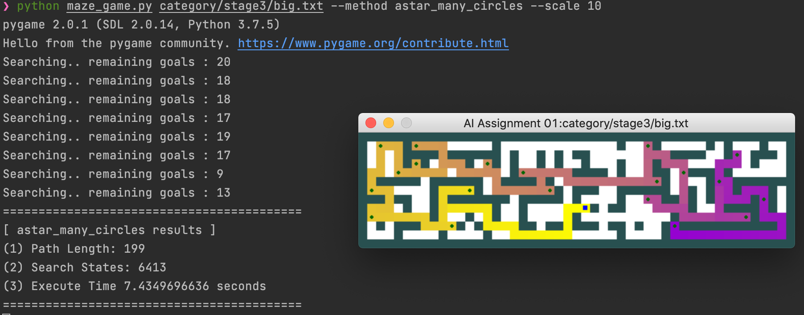

# Basic AI lecture in 2021-2 semester

- Learning a Basic AI course in 2021-2 semester
- Reference - Russell, S. and Norvig, P. (2021). Artificial Intelligence: A Modern Approach (4th edition). Pearson.
- using python

## pj1. maze

### stage1 - bfs vs astar

| size   | bfs (path 길이 / search states) | astar (path 길이 / search states) |
| ------ | ------------------------------- | --------------------------------- |
| small  | 9 / **16**                      | 9 / **14**                        |
| medium | 69 / **274**                    | 69 / **221**                      |
| big    | 211 / **647**                   | 211 / **548**                     |

### stage2 - heuristic function using manhatten dist vs using path length

| metric            | mst using manhatten dist as edge cost -- (1) | mst using path length as edge cost -- (2) |
| ----------------- | -------------------------------------------- | ----------------------------------------- |
| state 개수        | 1901 (stage2 - big.txt 기준)                 | 49 (stage2 - big.txt 기준)                |
| 수행시간          | 0.049 sec (stage2 - big.txt 기준)            | 1.126 sec (stage2 - big.txt 기준)         |
| stage3 - big size | 해결 못함                                    | 해결 함                                   |

## pj2. pacman

### 정리

|                                     | minimax                       | alphabeta                   |
| ----------------------------------- | ----------------------------- | --------------------------- |
| iteration 300, smallmap, depth=2    | Tot = 48.28 Avg = 0.16   | Tot = 40.82 Avg = 0.13 |
| iteration 300, mediummap, depth=2   | Tot = 121.16 Avg = 0.403 | Tot = 99.17 Avg = 0.33 |
| iteration 1000, minimaxmap, depth=4 | Tot = 75.23 Avg = 0.07   | Tot = 41.55 Avg = 0.04 |

**=> alphabeta agent가 minimax agent보다 효율적임을 알 수 있다. depth를 깊게 실험해보면, alphabeta agent의 pruning 효과가 더욱 극명하다.**

## pj3. logical agent

## pj4. MLP vs CNN

