# Assignment01 - Maze Game

## BFS와 A* Algorithm을 활용한 최단 경로 찾기 - 20121277 김주호

# 개요

- single goal을 가진 미로에서, goal까지 도달하는 최단 경로를 구하는 bfs 알고리즘과 astar 알고리즘을 작성한다.
- corner에 4개의 goal을 가진 미로에서, 4개의 goal을 모두 지나는 최단 경로를 구하는 a* 알고리즘을 작성한다.
- 다수의 goal을 불특정한 위치에 가지고 있는 미로에서, 주어진 goal을 모두 지나는 최단 경로를 구하는 a* 알고리즘을 작성한다.
  - heuristic 함수를 구할 때, mst를 활용하도록 한다.

# 사용한 라이브러리

- pygame
  - Python으로 작성 가능한 게임 등의 멀티미디어 표현을 위한 라이브러리이다.
  - 해당 라이브러리를 이용하여 txt 파일에 적힌 maze와 경로를 그래픽으로 볼 수 있다.
- collections 모듈의 deque 클래스
  - path를 얻는 데에 활용
    - pre 자료구조에 저장된 정보를 이용하여, 목적지부터 시작지점까지 거꾸로 거슬러 올라가면서, 지나온 경로를 구할 때 사용한다.
    - 도착지 쪽의 노드들에 먼저 접근하게 되는데 이 때, deque 자료구조가 가지고 있는 appendleft() 메서드를 이용하면, head부터 tail까지 최단 경로를 순서대로 저장할 수 있다.
  - bfs search에서 fringe로 que 자료구조를 이용하면서 활용
- heapq 모듈
  - a* 알고리즘의 fringe로 priority queue 자료구조를 활용하기 위해 사용함.

# 알고리즘

## stage1 미로 해결 - using bfs

- 사용한 자료구조

  - `que` : queue
  - `vis` : 
    - maze 크기의 2차원 배열
    - 원소는 boolean
  - `pre` :  
    - maze 크기의 2차원 배열
    - 원소는 위치를 표시하는 좌표 - 튜플로 표현됨

  

- logic

  - state를 결정하는 요인 - 현재 위치한 좌표 (cy, cx)

  

  state를 결정하는 요인은 오직 현재 위치한 좌표이다. 현재 위치한 좌표를 기준하여, manhatten 거리가 1 증가한 위치에 새로운 state를 만든다. 이미 방문한 state를 재방문하게 된다면, 최단 거리를 만들 수 없게 되므로, 재방문 하지 않도록 closed로 vis 배열을 활용하여 관리한다. goal state를 방문하게 되었을 때, 그것이 optimal한 solution임을 보장할 수가 있다.

  

- Pseudo code

  ```python
  def bfs(maze):
      start_point = maze.startPoint()
     	sy, sx = start_point
      ey, ex = maze.circlePoints()[0]  # goal이 하나
      R, C = maze.getDimensions()
  
      # 자료구조 선언
      que = que()
      vis = [[False for _ in range(C)] for _ in range(R)]
      pre = [[(-1, -1) for _ in range(C)] for _ in range(R)]
  
  		
      que.append((sy, sx))
      vis[sy][sx] = True
      while que:
          cy, cx = que.popleft()
          for ny, nx in maze.neighborPoints(cy, cx):
              if vis[ny][nx]: continue
  
              que.append((ny, nx))
              pre[ny][nx] = (cy, cx)
              vis[ny][nx] = True
              
              # goal을 만나게 됨
              if (ny, nx) == (ey, ex):
                  break
  
      path = get_path_using_position_seq(pre, sy, sx, ey, ex)
  
      return path
  ```

  


## stage1 미로 해결 - using astar

- 사용한 자료구조

  - `f`, `g`, `h`
    - maze 크기의 2차원 배열
    - 원소는 int형이다.
  - `pq`
    - priority queue
    - f 값이 가장 작은 state에 빠르게 접근하기 위해 사용하는 자료구조이다.
  - `pre`
    - maze 크기의 2차원 배열
    - 원소는 좌표를 나타내는 tuple이다.
    - `pre`\[ny]\[nx\]에 이전 state의 정보를 저장하여, 목적지에 도달하였을 때, 목적지부터 출발지까지 역추적하여 최단 경로를 얻어낼 수 있다. 

  

- logic

  - (y, x)에서의 heuristic function = (y, x)에서 goal까지의 manhatten 거리로 정의
  - state를 결정하는 요인
    - 현재 위치 : (cy, cx)
    - f 값(= g + h)

  

  (y, x)에서의 hueristic function의 값을 결정하는 요인이 오로지 (y, x) 뿐이기 때문에, 모든 위치에서의 h 값을 미리 전처리해둘 수 있다. 새로운 state를 expand할 때, g 값을 update하고, 미리 전처리 해 둔 h값과 더하여 f 값을 정의한다. 매 스테이지마다, 이 f 값이 가장 작은 값을 택하여, 다음 state를 만든다. f 값이 적은 방향을 택하는 것은 goal 쪽에 도달할 유인이 좋은 쪽을 택하는 것이기 때문에, bfs와는 달리 목적 지향적인 요소를 알고리즘에 반영한다.

  

- Pseudo code

  ```python
  def astar(maze):
      start_point = maze.startPoint()
      end_point = maze.circlePoints()[0]
      path = list()
  
      sy, sx = start_point
      ey, ex = end_point
      R, C = maze.getDimensions()
  
      # heuristic function 전처리
      h = [[0 for _ in range(C)] for _ in range(R)]
      for r in range(R):
          for c in range(C):
              if not maze.isWall(r, c):
                  h_val = manhatten_dist((r, c), (ey, ex))
                  h[r][c] = h_val
  		
      # init state 정의
      g = [[INF for _ in range(C)] for _ in range(R)]
      g[sy][sx] = 0
      f = [[INF for _ in range(C)] for _ in range(R)]
      f[sy][sx] = g[sy][sx] + h[sy][sx]
  		
      pre = [[(-1, -1) for _ in range(C)] for _ in range(R)]
      pq = priority_que()
      pq.push(f[sy][sx], sy, sx)
      while pq:
          _, cy, cx = pq.pop()
          # goal에 도달하면,
          if (cy, cx) == (ey, ex):
              path = get_path_using_position_seq(pre, sy, sx, ey, ex)
              break
  
          for ny, nx in maze.neighborPoints(cy, cx):
            	# update g and f
              new_dist = g[cy][cx] + 1
              if g[ny][nx] <= new_dist: continue  # edge cost가 모두 1
  
              g[ny][nx] = new_dist
              f[ny][nx] = g[ny][nx] + h[ny][nx]
              pq.push(f[ny][nx], ny, nx)
              pre[ny][nx] = (cy, cx)
          f[cy][cx] = -1
  
      return path
  ```

  

## stage2 미로 해결 - using astar

- 사용한 자료구조

  - `f`, `g`, `h`
    - dictionary
    - 원소는 int형이다.
  - `pq`
    - priority queue
    - f 값이 가장 작은 state에 빠르게 접근하기 위해 사용하는 자료구조이다.
  - `pre`
    - dictionary
    - 원소는 state이다. state는 다음과 같은 tuple로 정의한다.
      - (`f`[(y, x, remain_goals)], `g`[(y, x, remain_goals)], y, x, remain_goals)
    - `pre`\[new_state\]에 이전 state의 정보를 저장하여, 목적지에 도달하였을 때, 목적지부터 출발지까지 역추적하여 최단 경로를 얻어낼 수 있다.
  - stage 1을 해결할 때와 달라진 점은, `f`, `g`, `h`, `pre` 값이 성분 2개(stage 1을 해결할 때는 (y, x) 좌표로만 결정됨)로만 결정되는 것이 아니어서, 다양한 요인에 종속되는 결과임을 표현하기 위해, dictionary로 선언하였다.
    - 사용 예시 : `f`[(요인1, 요인2, 요인3, ..)] = 3
      

- **heuristic function**

  - **(y, x)에서의 heuristic function** 

    = (y, x)와 goal들의 좌표를 node로 하여 만든 graph의 MST cost. 단, edge cost는 노드와 노드를 잇는 **manhatten 거리**로 정의한다.

  - 노드와 노드를 잇는 edge cost를 실제 미로에서의 **path 길이**로 정한다면, 더욱 정교한 heuristic function이 될 수 있다. 그렇게 만든 heuristic function은 stage 3을 해결하는 데에 사용하여 이 둘의 성능을 비교하고자 한다. (-> 결과 분석)

  - MST를 이루는 모든 edge cost들을 더한 값을 mst cost라고 정의하면, 이 mst cost는 heuristic functon으로 좋은 기능을 할 수가 있다. 

    - 시작 노드와 goal 4개를 잇는 graph에서 mst cost를 구하면, 실제 path의 길이는 mst cost보다 크거나 같을 것이다. 
    - 즉, **admissible**하다.
    - 이 heuristic fuction을 A* 알고리즘에 반영하면, mst cost를 줄이는 방향으로 다음 state를 선택하게 된다.
    - mst cost를 줄이는 방향이 가까운 goal들로 향하는 방향이라고 생각할 수 있으므로, 효율적인 알고리즘이 될 수 있다. 

  - 다음은 MST를 구하는 **prim 알고리즘**을 적용하여 mst cost를 얻어내는 Pseudo code이다.

  ```python
  def heuristic_using_manhatten_dist_cost_edge(cy, cx, remain_goals):
      selected = list()
      un_selected = list(remain_goals)
  
      selected.append((cy, cx))
      manhatten_cost = 0
      while len(un_selected) != 0:
          min_dist, pos_of_min_val = find_min_cost_edge_using_manhatten_dist(selected, un_selected)
          manhatten_cost += min_dist
  
          selected.append(pos_of_min_val)
          un_selected = delete_ele_in_arr(pos_of_min_val[0], pos_of_min_val[1], un_selected)
      return manhatten_cost
  ```

  시작 정점 기준 제일 작은 dist로 떨어진 vertex를 greedy하게 택하면서, selected에 vertex를 모은다. 5개(시작 정점 + goal 5개)가 모이면 종료. 

- logic

  - state를 결정하는 요인
    - 현재 위치 : `(cy, cx)`
    - `f` 값, `g` 값 (f 값을 우선하되, 만약 f 값이 같은 경우 g값이 작은 것으로 택함)
    - `remain_goals` : 방문 처리 하지 않은 goal들이 몇 개인지

  

  (y, x)에서의 hueristic function의 값을 결정하는 요인으로 현재 위치 뿐만 아니라, 아직 방문 처리 하지 않은 goal들까지 고려되어야 하는 상황이다. 이전과 달리, 모든 위치에서의 h 값을 미리 전처리하는 것은 상당히 까다롭고, 새로운 state를 expand할 때 g 값을 update하면서, h 값도 또한 계산하는 것이 자연스럽다. 최단 경로 path를 구하기 위한 자료구조 `pre`가 `finge` 역할을 겸할 수 있다.


- Pseudo code

  ```python
  def astar_four_circles(maze):
      start_point = maze.startPoint()
      end_points = tuple(maze.circlePoints())
  
      sy, sx = start_point
  
      #  h를 결정하는 인자 = (위치 요소) + (남은 목적지들이 어떤게 있는지)
      g[(sy, sx, end_points)] = 0
      h[(sy, sx, end_points)] = heuristic_using_manhatten_dist_cost_edge(sy, sx, end_points)
      f[(sy, sx, end_points)] = g[(sy, sx, end_points)] + h[(sy, sx, end_points)]
  
      pq = priority_queue()
      init_state = (f[(sy, sx, end_points)], g[(sy, sx, end_points)], sy, sx, end_points)
      pq.push(init_state)
      while pq:
          cur_state = pq.pop()
          _, _, cy, cx, remain_goals = cur_state
          if (cy, cx) in remain_goals:
              # goals에서 원소 하나 제거 후, 상태 이어 받음
              remain_goals, g, h, f, pre = downsize_goals(remain_goals, cy, cx, g, h, f, pre)
              cur_state = (f[(cy, cx, remain_goals)], g[(cy, cx, remain_goals)], cy, cx, remain_goals)
  
          if len(remain_goals) == 0:
              path = get_path_using_state_seq(pre, init_state, cur_state)
              break
  
          for ny, nx in maze.neighborPoints(cy, cx):
            	# g update and h update
              g[(ny, nx, remain_goals)] = update_g(g, ny, nx, cy, cx, remain_goals)
              h[(ny, nx, remain_goals)] = update_h(maze, h, ny, nx, remain_goals, "m")  # means using 'm'anhatten dist edge
  
              f[(ny, nx, remain_goals)] = g[(ny, nx, remain_goals)] + h[(ny, nx, remain_goals)]
              nxt_state = (f[(ny, nx, remain_goals)], g[(ny, nx, remain_goals)], ny, nx, remain_goals)
              if nxt_state in pre: continue
  
              pq.push(nxt_state)
              pre[nxt_state] = cur_state
      return path
  ```

  


## stage3 미로 해결 - using astar

- 사용한 자료구조

  - stage2 미로 해결에 사용한 astar 알고리즘의 자료구조와 동일하다.
    

- **heuristic function**

  - **(y, x)에서의 heuristic function** 
    = (y, x)와 goal들의 좌표를 node로 하여 만든 graph의 MST 값. 다만, edge cost를 노드와 노드를 잇는 **path length로 정의**함.
  - 노드와 노드를 잇는 edge cost를 실제 미로에서의 path 길이로 정한다면, 더욱 정교한 방향성을 알고리즘에 반영할 수가 있다.
  - goal이 4개 이상인 경우에도 mst cost가 heuristic functon으로 좋은 기능을 할 수가 있다. 
    - 시작 노드와 goal 노드들을 잇는 graph에서 mst cost를 구하면, 실제 path의 길이는 mst cost보다 크거나 같을 것이다. 
    - 또한 2 * mst cost 보다 작다. 왜냐하면, 실제 path의 길이는 최악의 경우 mst 의 edge들을 왕복하여 2번 지나는 것이기 때문이다.
    - **admissible**하다.
    - 이 heuristic fuction을 A* 알고리즘에 반영하면, mst cost를 줄이는 방향으로 다음 state를 선택하게 된다.
    - mst cost를 줄이는 방향이 많은 goal들이 모여있는 방향이라고 생각할 수 있다.
    - 많은 goal들이 모여있는 곳을 일괄 처리하는 방식으로 미로를 탐색하면, 최적에 가까운 solution을 얻을 수 있다.
  - 다음은 MST를 구하는 **prim 알고리즘**을 적용하여 mst cost를 얻어내는 Pseudo code이다.

  ```python
  def heuristic_using_path_len_cost_edge(maze, cy, cx, end_points):
      selected = list()
      un_selected = list(end_points)
  
      selected.append((cy, cx))
      mst_cost = 0
      while len(un_selected) != 0:
          min_dist, pos_of_min_val = find_min_cost_edge_using_path_len(maze, selected, un_selected)
          mst_cost += min_dist
  
          selected.append(pos_of_min_val)
          un_selected = delete_ele_in_arr(pos_of_min_val[0], pos_of_min_val[1], un_selected)
      return mst_cost
  ```

  

- logic

  - state를 결정하는 요인
    - 현재 위치 : `(cy, cx)`
    - `f` 값, `g` 값 (f 값을 우선하되, 만약 f 값이 같은 경우 g값이 작은 것으로 택함)
    - `remain_goals` : 방문 처리 하지 않은 goal들이 몇 개인지

  

  **노드와 노드를 잇는 최단 거리 path를 edge cost로** 하는 MST를 구하는 것이 해당 알고리즘의 핵심이다. 노드와 노드를 잇는 최단 거리 path를 구하게 될 때, 사실상 stage1을 해결하는 A* 알고리즘을 수행하는 셈이 된다. maze의 크기가 커지면, 이 과정에 드는 시간이 길어지므로, edge cost를 구하게 될 때마다 `CACHE`에 저장해두고 반복해서 사용하도록 한다.

- Pseudo code

```python
def astar_many_circles(maze):
    start_point = maze.startPoint()
    end_points = tuple(maze.circlePoints())

    sy, sx = start_point

    #  h를 결정하는 인자 = (위치 요소) + (남은 목적지들이 어떤게 있는지)
    g[(sy, sx, end_points)] = 0
    h[(sy, sx, end_points)] = heuristic_using_path_len_cost_edge(maze, sy, sx, end_points)
    f[(sy, sx, end_points)] = g[(sy, sx, end_points)] + h[(sy, sx, end_points)]

    pq = priority_queue()
    init_state = (f[(sy, sx, end_points)], g[(sy, sx, end_points)], sy, sx, end_points)
    pq.push(init_state)
    while pq:
        cur_state = pq.pop()
        _, _, cy, cx, remain_goals = cur_state
        if (cy, cx) in remain_goals:
            # goals에서 원소 하나 제거 후, 상태 이어 받음
            remain_goals, g, h, f, pre = downsize_goals(remain_goals, cy, cx, g, h, f, pre)
            cur_state = (f[(cy, cx, remain_goals)], g[(cy, cx, remain_goals)], cy, cx, remain_goals)

        if len(remain_goals) == 0:
            path = get_path_using_state_seq(pre, init_state, cur_state)
            break

        for ny, nx in maze.neighborPoints(cy, cx):
            g[(ny, nx, remain_goals)] = update_g(g, ny, nx, cy, cx, remain_goals)
            h[(ny, nx, remain_goals)] = update_h(maze, h, ny, nx, remain_goals, "p")  # means using 'p'ath_len edge

            f[(ny, nx, remain_goals)] = g[(ny, nx, remain_goals)] + h[(ny, nx, remain_goals)]
            nxt_state = (f[(ny, nx, remain_goals)], g[(ny, nx, remain_goals)], ny, nx, remain_goals)
            if nxt_state in pre: continue

            pq.push(nxt_state)
            pre[nxt_state] = cur_state
    return path
```


# 프로젝트 결과

1. bfs method로 실행한 stage1의 small.txt,medium.txt,big.txt 경로 그림과 출력 캡처 화면

   - `small.txt`

     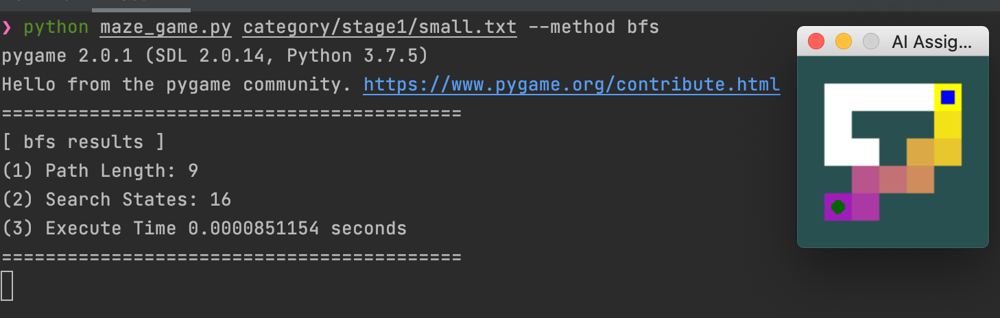

     

   - `medium.txt`

     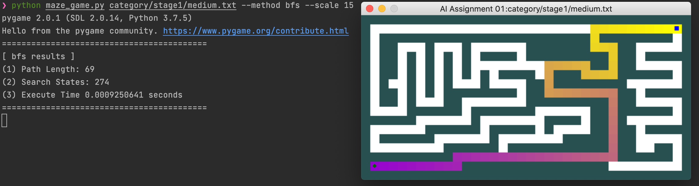

     

   - `big.txt`

     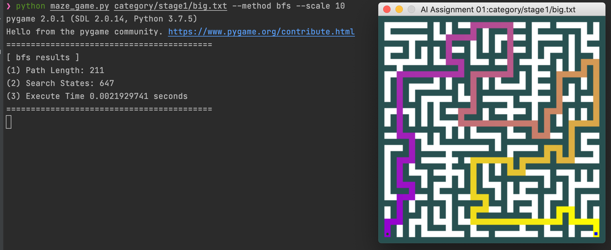

     

2. astar method로 실행한 stage1의 small.txt,medium.txt,big.txt 경로 그림과 출력 캡처 화면

   - `small.txt`
     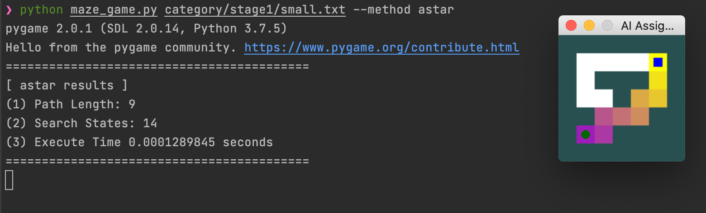

     
     
   - `medium.txt`
     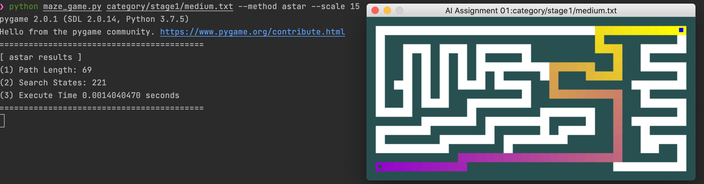

     
     
   - `big.txt`
     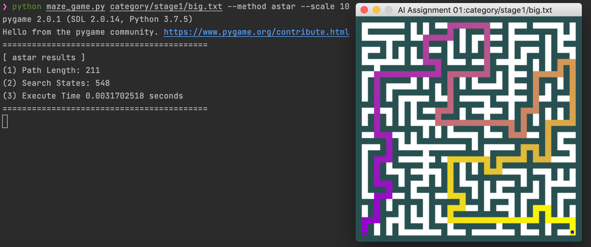

     

3. astar_four_circles method로 실행한 stage2의 small.txt,medium.txt,big.txt 경로 그림과 출력 캡처 화면

   - `small.txt`
     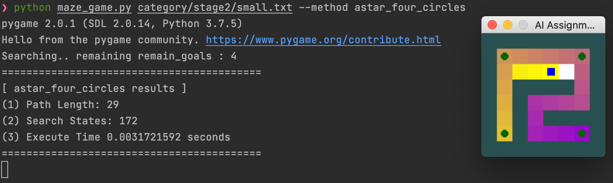

     
     
   - `medium.txt`
     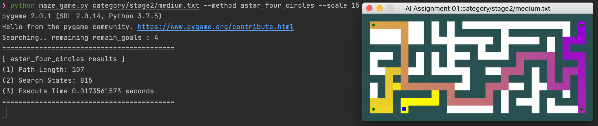

     
     
   - `big.txt`
     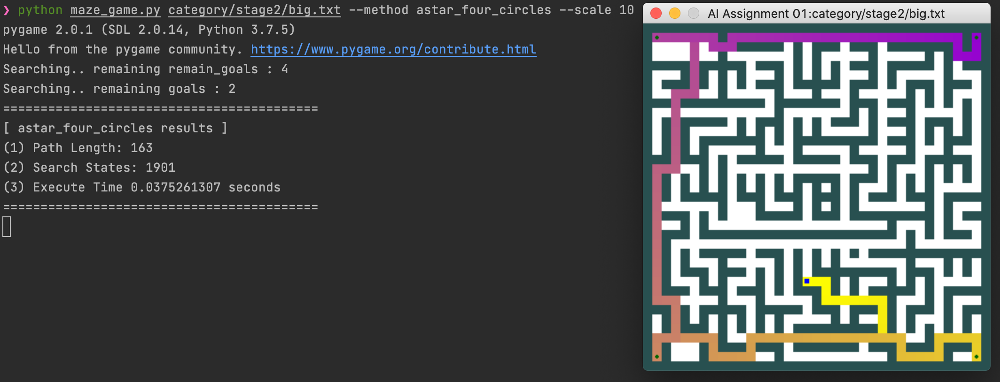

     

4. astar_many_circles method로 실행한 stage3의 small.txt,medium.txt,big.txt 경로 그림과 출력 캡처 화면

   - `small.txt`
     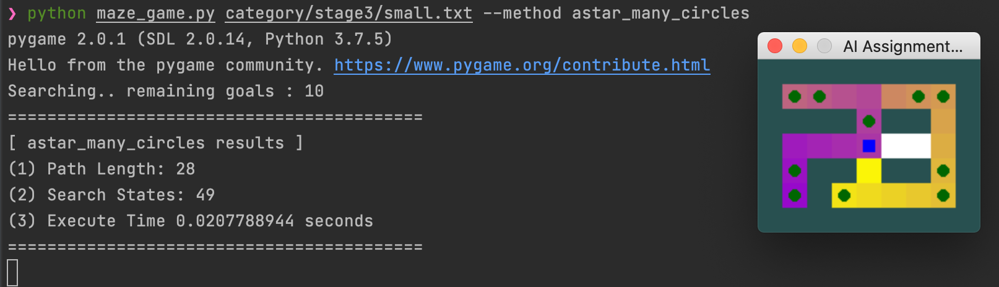
     
     
     
   - `medium.txt`
     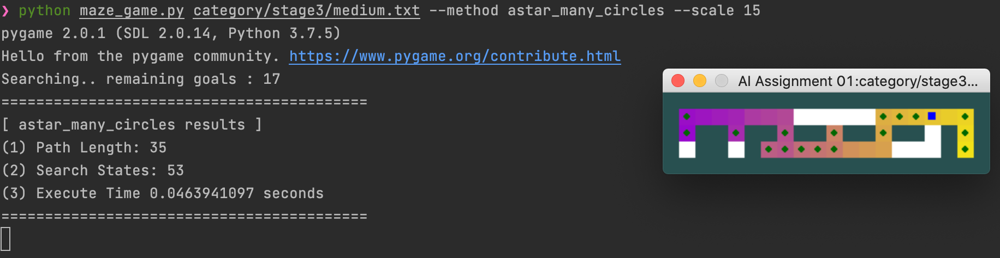
     
     
     
   - `big.txt`
     

# 결과 분석

## stage1 - bfs vs astar

| size   | bfs (path 길이 / search states) | astar (path 길이 / search states) |
| ------ | ------------------------------- | --------------------------------- |
| small  | 9 / **16**                      | 9 / **14**                        |
| medium | 69 / **274**                    | 69 / **221**                      |
| big    | 211 / **647**                   | 211 / **548**                     |

- bfs의 search state가 astar에 비해 더 많다.
  - bfs 알고리즘에는 goal을 향한 목적을 지향하여 다음 state를 expand하는 로직이 없기 때문에(즉, 방향성을 주는 logic이 없기 때문에) 더 많은 search state를 만들어 냄을 알 수 있다.
- bfs의 수행시간이 미세하게 astar에 비해 빠르지만, 실험의 maze 사이즈에 국한한다면, 유의미한 차이는 아니다. 


## stage2 - heuristic function using manhatten dist vs using path length

| metric            | mst using manhatten dist as edge cost -- (1) | mst using path length as edge cost -- (2) |
| ----------------- | -------------------------------------------- | ----------------------------------------- |
| state 개수        | 1901 (stage2 - big.txt 기준)                 | 49 (stage2 - big.txt 기준)                |
| 수행시간          | 0.049 sec (stage2 - big.txt 기준)            | 1.126 sec (stage2 - big.txt 기준)         |
| stage3 - big size | 해결 못함                                    | 해결 함                                   |

- 표의 왼쪽 컬럼은 heuristic function으로 manhatten dist를 edge cost로 하는 그래프를 만들고, mst cost를 택한 경우이다. --- (1)
- 표의 오른쪽 컬럼은 heuristic function으로 path length를 edge cost로 하는 그래프를 만들고, mst cost를 택한 경우이다. --- (2)
- (1)은 state를 많이 expand한 반면, (2)는 그에 비해 적은 state를 expand하였다.
  - path length를 cost edge로 하는 그래프롤 생성하여 mst cost를 구하는 것이 더 좋은 방향성을 주는 heuristic function임을 알 수 있다.
  - manhatten dist는 manhatten 거리는 가까움에도 미로가 구불구불하여 path length가 길어지는 맵에서는 방향성을 제대로 주지 못할 것이다. 
- state 개수가 (1)이 몇 배 많은데도, (1)은 수행시간이 빠른 반면, (2)는 그에 비해 느리다.
  - (1)은 하나의 edge cost를 O(1)의 간단한 계산에 의해 구할 수 있는 반면, (2)는 edge cost를 구할 때 stage 1을 해결하는 node to node 최단경로 알고리즘을 O(Rows * Columns) 수행한다. (-> CACHE를 이용하여, 반복 계산을 줄이려는 시도 필요)
  - 따라서 (2)는 하나의 state를 생성하는 시간에서 overhead가 (1)에 비해 훨씬 클 수 밖에 없다.
  - state 개수와 수행시간 사이에 tradeoff가 있음을 알 수 있다.
- (1)의 알고리즘으로는 stage3 - big.txt 미로 문제를 해결하지 못하는 반면, (2)의 알고리즘은 stage3 - big.txt 미로 문제를 해결할 수 있다.
  - (1)은 heuristic function이 정교하지 않아서, goal의 개수가 많아지면 방향성을 잘 정하지 못하고, 특정 로컬에 맴도는 것을 관찰할 수 있다.