# 알고리즘 구현 방법

## MinimaxAgent 클래스의 Action 메서드

- 3가지 함수를 선언하였다.
  - `def minimax_handler(state, agent_idx, depth)`
  - `def max_player(state, agent_idx, depth)`
  - `def min_player(state, agent_idx, depth)`
- max player는 nxt state들이 만든 return 값 중 최대값을 return하며, min_player 함수를 재귀적으로 call 한다.
- min player는 nxt state들이 만든 return  값 중 최소값을 return 한다.
  - 현재 agent에 따라 다른 재귀함수를 call 하게 된다.
  - next agent가 ghost인 경우, 또 다른 ghost의 min player를 call한다.
  - next agent가 pacman인 경우, max player를 call 하며, depth를 하나 증가시킨다.
- depth가 `self.depth`가 되는 경우 말단 노드에 도달한 것이고, self.evaluationFunction(state)를 돌려주게 된다.
- `minimax_handler()`는 이 모든 함수 call의 흐름을 제어한다.


## AlphaBetaAgent 클래스의 Action 메서드

- 3가지 함수를 선언하였다.

  - `def alphabeta_handler(state, depth, agent_index, alpha=-INF, beta=INF)`
  - `def max_player(state, depth, agent_index, alpha=-INF, beta=INF)`
  - `def min_player(state, depth, agent_index, alpha=-INF, beta=INF)`

- 기본적인 함수 call의 흐름은 minimax agent와 동일하며, 이를 `alphabeta_handler()`가 제어한다.

- minimax agent와 다른 점은 함수에 alpha, beta 인자를 추가하여, alpha, beta 값과 노드의 값을 비교하여 pruning의 개념을 추가한 점이다.

  ```python
  ## max player의 경우
  mxv = max(mxv, eval)
  alpha = max(alpha, eval)
  if alpha >= beta:  # pruning
    	return mxv
  .
  .
  .
  ## min player의 경우
  mnv = min(mnv, eval)
  beta = min(beta, eval)
  if beta <= alpha:  # pruning
    	return mnv
  ```

  

- alpha 값은 - inf로 beta 값은 inf로 초기화한다.

- max player의 경우, 모든 successor state들을 보면서 `self.evaluationFunction(state)`을 통해 넘겨받은 리턴 값과 alpha 값의 maximum 값으로 alpha 값을 갱신한다.

- 이 갱신한 alpha 값이 beta 값 이상의 값을 갖는 경우, pruning을 수행한다.

- 왜냐하면, 그 위의 min_player가 beta 값 이하의 값을 취하는 것이 개런티 되어있는데, beta 이상의 값을 넘겨 받는 순간 해당 가지는 min_player의 선택을 받을 수 없는 가지이므로 잘라내도 되는 것이다.

- 마찬가지로, min player도 successor가 alpha보다 작거나 같은 beta 값으로 갱신이 될때, 가지치기로 잘라낼 수 있다.

- 왜냐하면, 그 위의 max_player가 alpha 값 이상의 값을 취하는 것이 개런티 되어있는데, 그 alpha 값보다도 작은 값을 return한다면, 이는 max_player의 선택을 받을 수 없는 가지이므로 잘라낼 수 있다.


## ExpectimaxAgent 클래스의 Action 메서드

- 3가지 함수를 선언하였다.

  - `def expectimax_handler(state, agent, depth)`
  - `def max_player(state, agent, depth)`
  - `def exp_player(state, agent, depth)`

- 기본적인 함수 call의 흐름은 minimax agent와 동일하며, 이를 `expectimax_handler()`가 제어한다.

- min player의 동작 대신 exp player의 동작으로 대신하면 된다.

- exp player는 min player와는 다르게 nxt state 값의 최소를 선택하는 것이 아니라, 각 state를 선택할 가능성이 확률적으로 분배되어있다고 본다.

- 해당 agent의 action에서는 그 확률이 **uniformly distributed 되어있다는 가정**을 하고, 균등하게 확률을 분배하였다.

  ​	

  ```python
  p = 1 / len(state.getLegalActions(agent))
  ```

- exp player는 위에서 정의한 확률대로, successor들에게서 기대되는 값을 return하게 된다.

  ```python
  exp_val = 0
  for action in state.getLegalActions(agent):
    	nxt_state = state.generateSuccessor(agent, action)
    	p = 1 / len(state.getLegalActions(agent))
    	exp_val += p * expectimax_handler(nxt_state, nxt_agent, depth)
    	return exp_val
  ```

  


# Agent 실행 


## Minimax Agent

다음의 명령어로, minimaxmap에서 minimax agent의 승률을 확인한다.

```shell
python pacman.py -p MinimaxAgent -m minimaxmap -a depth=4 -n 1000 -q
```


### 실험 1 결과.

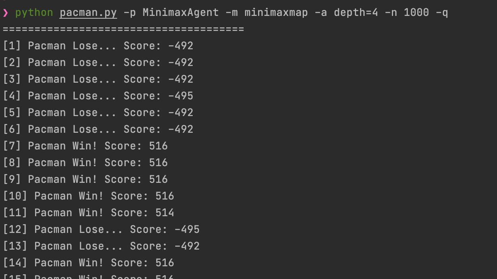

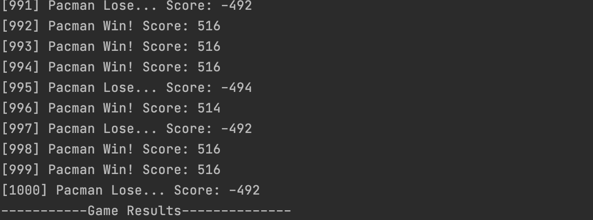

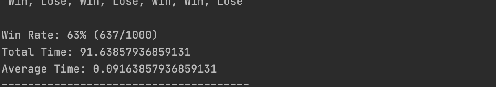


### 실험 2 결과.

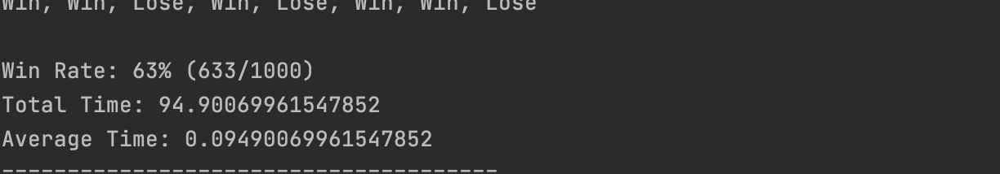

### 실험 3 결과.

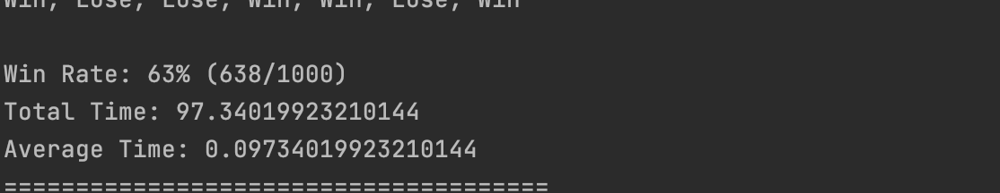

minimaxmap에서 minimax agent의 승률이 50% ~ 70%가 됨을 확인할 수 있다.


## AlphaBeta Pruning Agent

다음의 명령어로 minimax agent와 alphabeta agent의 수행시간을 비교하여, alphabeta agent의 pruning이 잘 작동하는지 확인한다.

```shell
python time_check.py
```


### 실험 결과

- minimax, depth=2, smallmap

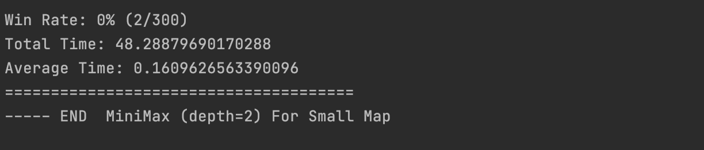

- alphabeta, depth=2, smallmap

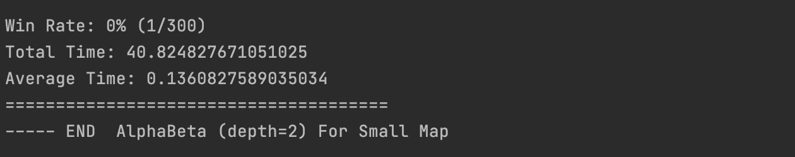

- minimax, depth=2, mediummap

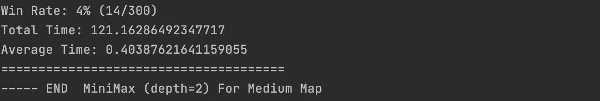

- alphabeta, depth=2, mediummap

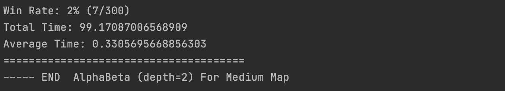

- minimax, depth=4, minimaxmap

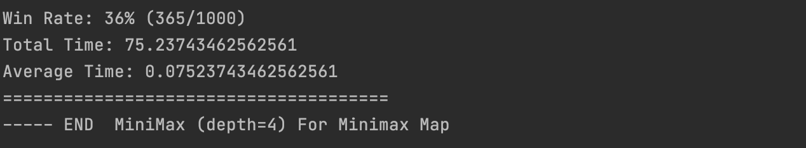

- alphabeta, depth=4, minimaxmap

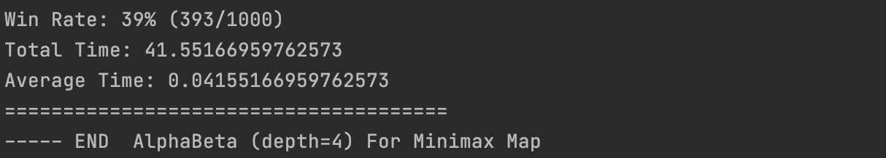


### 정리

|                                     | minimax                       | alphabeta                   |
| ----------------------------------- | ----------------------------- | --------------------------- |
| iteration 300, smallmap, depth=2    | Tot = 48.28<br />Avg = 0.16   | Tot = 40.82<br />Avg = 0.13 |
| iteration 300, mediummap, depth=2   | Tot = 121.16<br />Avg = 0.403 | Tot = 99.17<br />Avg = 0.33 |
| iteration 1000, minimaxmap, depth=4 | Tot = 75.23<br />Avg = 0.07   | Tot = 41.55<br />Avg = 0.04 |

=> alphabeta agent가 minimax agent보다 효율적임을 알 수 있다. depth를 깊게 실험해보면, alphabeta agent의 pruning 효과가 더욱 극명하다.


## Expectimax Agent

- 다음의 명령어로 stuckmap에서 expectimax agent가 50%의 승률을 얻는지 확인한다.
- 이긴 경우에 `532 score`, 진 경우에 `- 502 score` 를  얻는지 관찰하여 expectimax agent의 동작을 점검한다.

```shell
python pacman.py -p ExpectimaxAgent -m stuckmap -a depth=3 -n 100 -q
```


### 실험 1 결과.

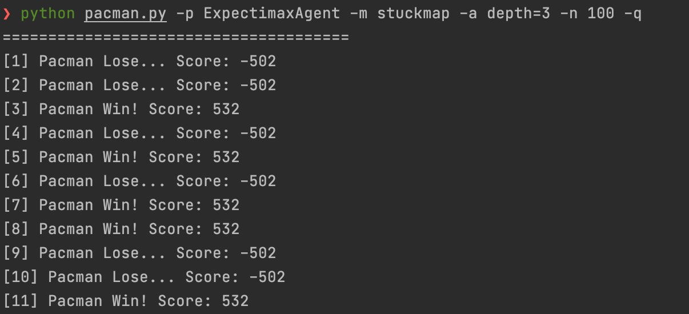

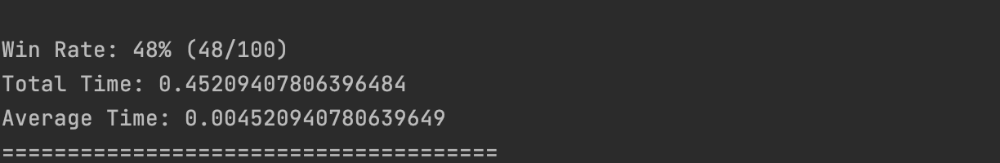


### 실험 2 결과

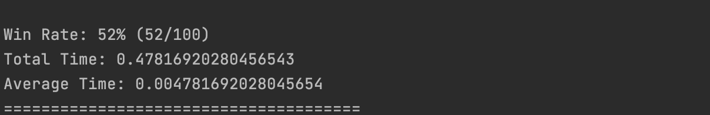


### 실험 3 결과

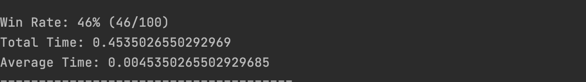


- stuckmap에서 expectimax agent가 50% 정도의 승률을 얻는다.
- 이긴 경우에 `532 score`, 진 경우에 `- 502 score` 를  얻는다.