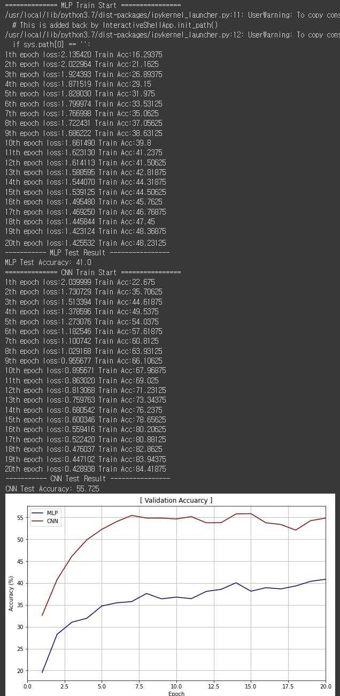

**20121277 김주호 - `MLP` vs `CNN**`

- **직접 구현한 MLP model의 layer 구성에 대한 간단한 설명**

  - layer의 개수는 5개로 구성하였다.
  - 은닉층의 차원은 input_size의 30% 정도로 구성하였다.
  - 은닉층의 차원을 늘리거나, layer의 개수를 많이 늘리게 될 때, 기대한 성능 향상 효과는 얻을 수 없었고, 되려 계산이 많아져 학습에 소요되는 시간이 많아지게 되었다.
  - 따라서, `self.n_layers`의 값과 `self.intermediate_dim`의 값을 허용 범위 안에서 비교적 작은 값으로 설정하였다.
  - `nn.Sequantial`을 사용하면, `__init__()`에서 네트워크 모델을 정의한 후, `forward()` 함수에서 forward propagation을 구현하는 방향으로 가독성이 더 좋게 코드를 작성할 수 있게 된다.
  - `forward()`에서는 input data를 flatten 시킨 뒤, 정의한 layer들을 주게 된다.

- **직접 구현한 CNN model의 layer 구성에 대한 간단한 설명**

  - 은닉층의 차원을 256 정도로 설정하였다.
  - `convolutional layer`
    - 30x30x3의 데이터를 convolution 연산하여, 30x30x12의 데이터로 만드려면, filter size를 3x3으로 설정해야 한다.
    - 마찬가지로 30x30x12의 데이터를 28x28x12의 데이터로 만들기 위해서 filter size를 3x3으로 설정한다.
    - 28x28x12의 데이터를 14x14x12로 절반 줄이기 위해서는 fileter size를 2x2로 설정한다.
    - conv3, conv4에 대하여도 동일한 작업을 반복한다.
  - `fully connected layer`
    - feature learning과 fully connected 사이에 이미지의 형태의 데이터를 배열 형태로 만드는 flatten  layer가 위치하게 된다.
    - 정확한 라벨을 예측하기 위해 가중치를 적용한다.
    - 마지막에 정사영하면서, 각 레벨에 대한 최종 확률을 제공한다.

- **선택한 Activation function에 대한 설명과 선택한 이유**

  - activation function으로 `relu`를 택하였다.
  - 데이터가 복잡해지면, 데이터의 분포는 단순한 linear의 형태가 아닌 non-linear의 형태를 가지게 된다.
  - 이러한 데이터 분포를 가지는 경우 1차식의 linear 형태로는 데이터를 표현할 수 없다.
  - multi-layer의 activation으로 relu를 사용한 이유는 linear한 부분 부분의 결합 합성함수가 만들어지고, linear한 결합이 쌓여서 non-linear한 성질을 가질 수 있게 된다.
  - gradient가 출력층과 멀리 있는 layer까지 전달될 수 있다는 장점이 있고, 데이터에 적합한 fitting을 하게 된다.

- **결화 화면 캡쳐**

  